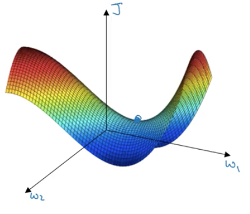

# Mini-batch Gradient Descent
- Mini-batch gradient descent involves using small subset of the dataset X to compute each step of gradient descent. We will refer to a batch using the term $x^{\{i\}}$ (e.g. $x^{\{i\}}$ would contain $[x^{\{1\}}$...$X^{(1000)}]$, $x^{\{2\}}$ would contain $[x^{(1001)}...$X^{(2000)}]$ etc.)
- For each group $X^{\{i\}}$ there is a corresponding subset of $Y$, $Y^{\{i\}}$
- Gradient descent is run the same was as batch gradient descent except you run it over the subset $\{{i}\}$.
- Before performing batch gradient decent you should shuffle the order of the X/Y pairs.
- You run forward prop over the subset, then backprop over the subset, then update the weights.
- A single pass through the entire training set is known as doing an `epoch` of training.
- On mini-batch gradient descent it's possible for the gradient to go up between iterations.
- If mini-batch is equal to $m$ you just end up with mini-batch gradient descent.
- If you mini-batch is equal to 1 then you have stochastic gradient descent.
- Stochastic gradient will never converge but batch gradient descent always will.
- Performing mini-batch gradient descent will give you something in-between.
- With mini-batch gradient descent you can make progress without having to process the entire dataset.
- If you have less than 2000 training points than just use gradient descent.
- Typically batch sizes are powers of 2 between 64 and 512. This is because sometimes code runs faster as a power of 2.
- Make sure that you're batch size will actually fit in CPU/GPU memory.

## Exponentially Weighted Averages
- Is a way of approximating a moving average over the previous $\frac{1}{1-\beta}$ days using only two points at a time.
- First you set the initial value, $V_0$, equal to 0.
- Calculate each value using the function $V_t=\beta V_{t-1} + (1-\beta) \Theta_{t}$.
- $\Theta_{t}$ is the actual value.
- $V_{t-1}$ is the previously calculated value using the above formula.
- Doesn't provide as good an average as a true average but it's computationally efficient. Typical it is used if you had a lot of data or a lot of variables.
- Bias Correction. Because the initial value is zero there is often a bias in the beginning of the algorithm that leads to inaccurate estimates. To correct for this you can modify the equation to $V_t=\frac{\beta V_{t-1} + (1-\beta) \Theta_{t}}{1-\beta^t}$.

## Gradient Descent With Momentum
- Almost always better than normal gradient descent.
- Compute an exponentially weighted average of your gradients, and then use that gradient to update your weights instead.
- This is essentially accomplished by modifying the gradients at each step of gradient descent to be the exponential average of the gradient.

- The most common $\beta$ values is 0.9 which is an approximate of an average over the last ten examples.
- It's not common in practice to see people doing bias correction on gradient descent because the bias is worked out after 10 iterations.
- In the literature it is more common to see use of the equation $V_t=\beta V_{t-1} + \Theta_{t}$ and in practice they give similar results.
- One problem with using the simplified equation is that it changes the scale of the derivatives and you end up having to retune the learning rate.

## RMSprop (Root Mean Squared prop)
- This is a method similar to adding momentum to gradients.
- You update the parameters $W$ and $b$ as follows.
  - $S^{dw}=\beta_2 S^{dw} + (1-\beta_2)dW^2$
  - $S^{db}=\beta_ 2 S^{db} + (1-\beta_ 2)db^2$
  - $W:=W-\alpha\frac {dW}{\sqrt{S^{dw}}}$
  - $b:=b-\alpha\frac {db}{\sqrt{S^{db}}}$
- Has the effect of damping out oscillations of the gradient descent thus speeding up convergence.

## Adam Optimization Algorithm (Adaptive Moment Estimation)
- Putting together RMSprop and Momentum.
- Set $V_{dW}, S_{dw}, V_{db}, S_{db}$ all to zero.
- Compute $dW, dB$ using the current mini-batch.
- $V_{db}=\beta_1 V_{db} + (1-\beta_1) db$
- $V_{dW}=\beta_1 V_{dW} + (1-\beta_1) dW$
- $S_{dw}=\beta_2 S_{dW} + (1-\beta_2) dW^2$
- $S_{db}=\beta_2 S_{db} + (1-\beta_2) db^2$
- $V_{dW}^{corrected}=\frac{V_{dW}}{1-\beta_1^t}$
- $V_{db}^{corrected}=\frac{V_{db}}{1-\beta_1^t}$
- $S_{dW}^{corrected}=\frac{S_{dW}}{1-\beta_2^t}$
- $S_{db}^{corrected}=\frac{S_{db}}{1-\beta_2^t}$
- $W:=W-\alpha\frac{V_{dW}^{corrected}}{\sqrt{S_{dW}^{corrected}} + \epsilon}$
- $b:=b-\alpha\frac{V_{db}^{corrected}}{\sqrt{S_{db}^{corrected}} + \epsilon}$
- Alpha needs to be tuned.
- By default $\beta_1$ is 0.9.
- By default $\beta_2$ is 0.999.
- By default $\epsilon$ is $10^{-8}$.
- In practice most people use the default hyperparameters.

## Learning Rate Decay
- Slowly reducing the learning rate during gradient descent.
- This really isn't important for batch gradient descent.
- The purpose is to help keep the grant from wandering in a large area around the minimum. As you get close to the minimum you decrease the size of steps forcing it to converge.
- You set $\alpha$ to a dynamic value such as
  - $\alpha=\frac{1}{1+decayRate\times epochNum}\alpha_0$
  - $\alpha = 0.95^{epochNum}\times \alpha_0$ You can replace 0.95 with any positive  value less than 1. This is known as exponential decay.
  - $\alpha = \frac{k}{epochNum}\times \alpha_0$
  - Or they just decrease it by a discrete number after every $n$ steps known as discrete staircase.
  - Manual Decay is tuning alpha by hand. You are literally monitoring how the algorithm is running and tweaking the learning rate.
- Getting a good learning rate in the first place is typically more important than implementing some kind of learning rate decay.

## Local Optima
- Most local places where the gradient is zero in machine learning algorithms are saddle points.

- Plateaus tend to be a bigger problem than local optima. They make the learning really slow until the algorithm gets off the plateau.
- Using tools like Adam can help greatly speed up your algorithms ability to get off the plateaus.
